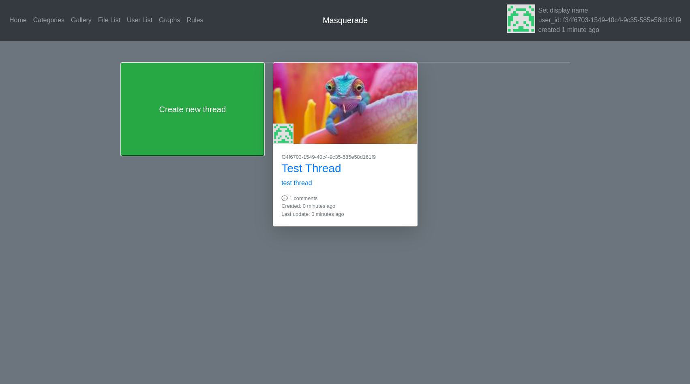

# Thesis
Engineer thesis written in Django: Anonymous forum which do not require typical any manual registration from user.
Users after posting any message on any board are getting automatically generated JWT token for them.

Project was done using a monolithic architecture.

## Running
Ensure you have docker and docker-compose on machine.
```shell
# in Thesis-Django-Forum project directory
docker-compose up
```

## Screenshot

NOTE: UI/UX wasn't primary concern during development.

## Features
- Categories (similar function to Reddit's Subreddits)
- Creating Threads under categories
- Commenting in threads with image and file upload is supported
- Self-cleaning it looks for inactive threads (somewhat configurable) and purge them from database
- Thread popularity using moving average
- No registration, JWT Token is automatically generated when needed.
It is also used for auth is persistent in current session (no functionality for exporting)
- Live thread updates using websockets and redis

NOTE: Config for nginx's https was deleted to allow nginx fresh/easy test run.

## Additional Tools
Additional tools used in project:
- redis
- nginx
- postgresql
- uvicorn for async
- cron
- docker
- jinja
- js, bootstrap, html for views
- lex
